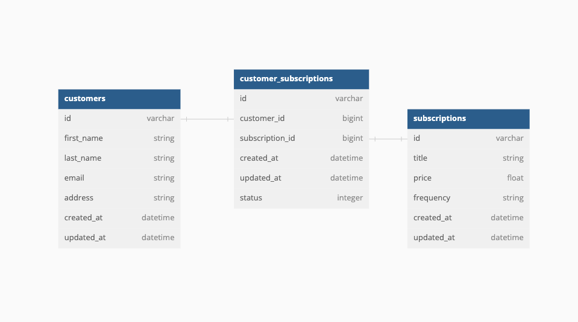
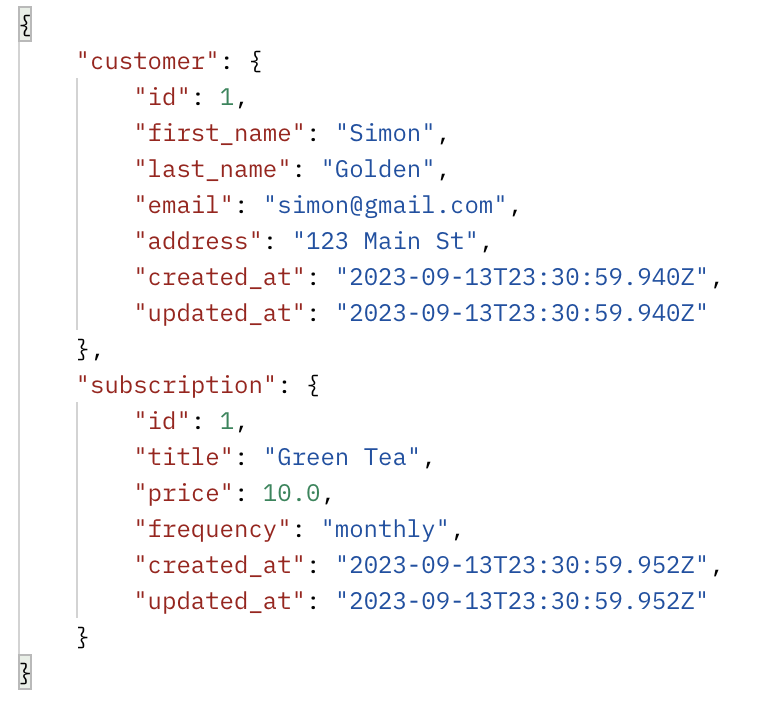
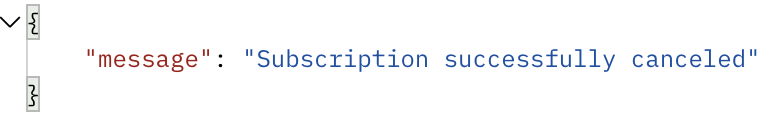
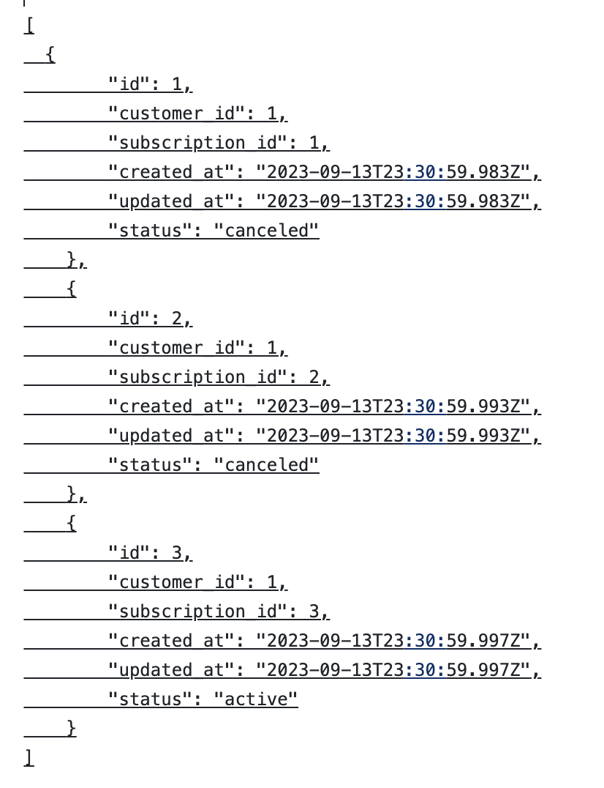

<h1>Tea Subscription</h1>

**DB schema**

**How to install the project?** 
Fork and clone this repo 
Run bundle install 
Run rails db:{create,migrate,seed} 
Usebundle exec rspec to run the test suite  

<h2>API JSON CONTRACT</h2>
Description of API endpoints for front end application  

**A customer can subscribe to a tea subscription:** 
POST /api/v1/customers/:customer_id/subscriptions/:subscription_id  

Success Response (201 Created):  

Status: 201 Created 
Description: Successful response with customer and subscription information. 
Data Format: A hash containing a customer hash and a subscription hash, each containing relevant attributes. 
Status: 201 Created 

**A customer can cancel a tea subscription:** 
PATCH /api/v1/customers/:customer_id/subscriptions/:subscription_id  

Success Response (200 OK):  

Status: 200 OK 
Description: Successful response with confirmation message. 
Data Format: A hash containing a confirmation message. 
Status: 200 OK 

**A customer can see their subscription history:** 
GET /api/v1/customers/:customer_id/subscriptions  

Success Response (200 OK):  

Status: 200 OK 
Description: Successful response that displays active and canceled subscriptions. 
Data Format: An array of hashes containing subscription history. 
Status: 200 OK 

